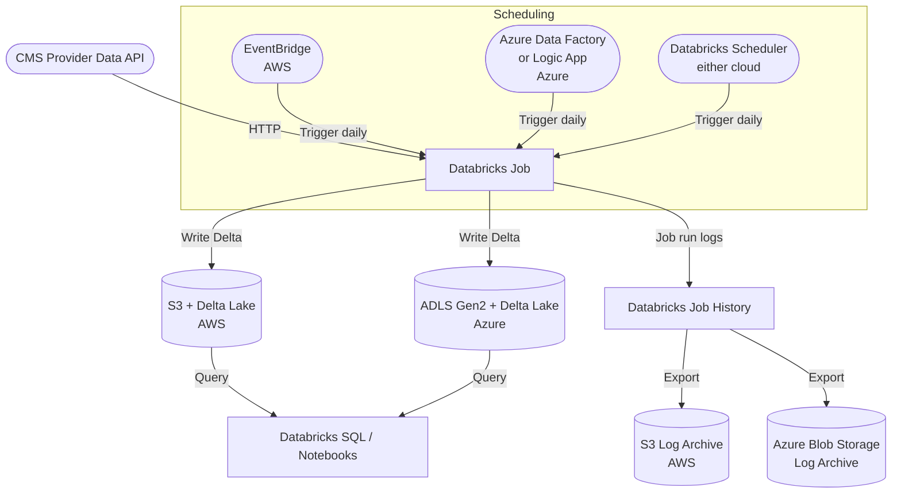
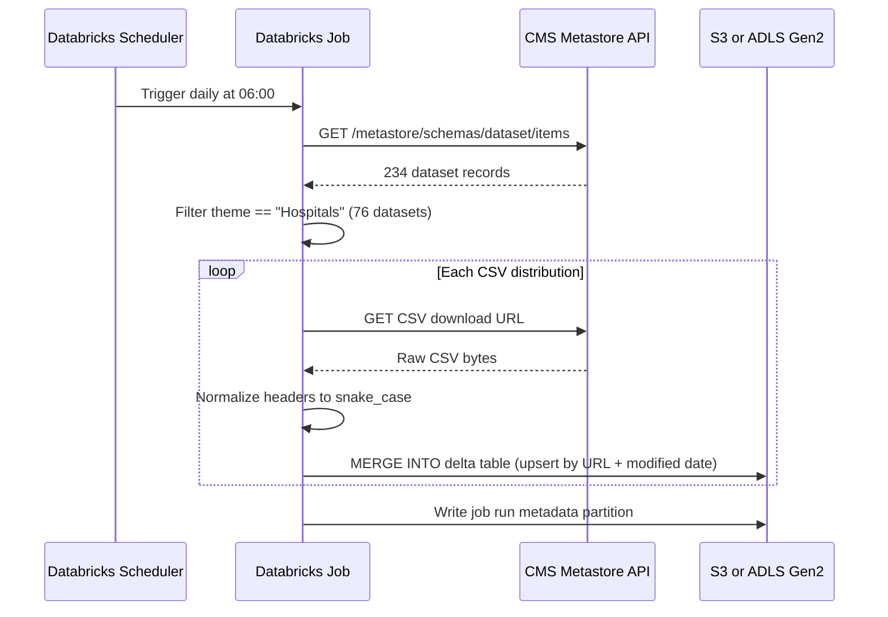

# Future State Architecture: CMS Hospital Data Pipeline

## Overview

In production this pipeline runs as a scheduled Databricks Job. Raw CSVs land in cloud object storage as a Delta Lake, giving ACID transactions and time travel out of the box: no manual modification-date tracking needed. Delta's incremental read patterns replace the `run_metadata.json` approach used in local development.

The architecture below covers both AWS and Azure since Databricks runs natively on either. AWS-specific services are noted with **(AWS)** and Azure-specific with **(Azure)**. All infrastructure would be provisioned and managed via Terraform using the appropriate provider (`hashicorp/aws`, `hashicorp/azurerm`, and `databricks/databricks`).

---

## High-Level Architecture



---

## Data Flow



---

## Component Breakdown

### Scheduling
- **Databricks Scheduler:** built-in cron-based trigger, works on both AWS and Azure with no extra services
- **AWS:** EventBridge rule targets the Databricks Jobs API for tighter AWS orchestration
- **Azure:** Azure Data Factory pipeline or Logic App triggers the job via the Databricks REST API

### Compute: Databricks Job
- Runs the pipeline script on a job cluster or serverless compute
- Works identically on AWS and Azure: only the storage and identity config differs
- Parallel downloads handled by `ThreadPoolExecutor`: same as local, or refactored to use Spark for very large datasets

### Object Storage (Data Lake)
- **AWS:** S3 with Delta Lake; cluster accesses S3 via an IAM instance profile attached to the Databricks cluster
- **Azure:** Azure Data Lake Storage Gen2 (ADLS Gen2) with Delta Lake; cluster accesses ADLS via a Managed Identity or Service Principal
- One Delta table per CMS dataset regardless of cloud
- Delta handles versioning and time travel: no need for `run_metadata.json`
- Incremental loads use `MERGE INTO` to upsert changed rows rather than re-writing entire files
- Raw CSV layer kept alongside Delta for auditability

### Metadata Tracking
- Delta transaction log replaces `run_metadata.json`
- `modified` timestamps stored as partition metadata or a dedicated `_pipeline_metadata` Delta table
- Time travel lets you query any historical snapshot: `SELECT * FROM table VERSION AS OF 7`

### Logging
- Databricks Job run history captures stdout/stderr natively on both clouds
- **AWS:** Structured logs shipped to S3 via Databricks log delivery; queryable via Athena
- **Azure:** Logs shipped to Azure Blob Storage; queryable via Azure Synapse or Log Analytics

### Identity and Access
- **AWS:** IAM role with S3 read/write permissions attached to the Databricks instance profile
- **Azure:** Managed Identity or Service Principal with Storage Blob Data Contributor role on the ADLS Gen2 account

### Infrastructure as Code (Terraform)
All resources provisioned via Terraform:

| Resource | AWS Provider | Azure Provider |
|---|---|---|
| Object storage | `aws_s3_bucket` | `azurerm_storage_account` + `azurerm_storage_data_lake_gen2_filesystem` |
| Identity / access | `aws_iam_role`, `aws_iam_policy` | `azurerm_user_assigned_identity`, role assignment |
| Scheduling | `aws_cloudwatch_event_rule` | `azurerm_logic_app_workflow` or ADF pipeline |
| Databricks workspace | `databricks/databricks` provider | `azurerm_databricks_workspace` + `databricks/databricks` provider |
| Databricks job | `databricks_job` | `databricks_job` (same resource, both clouds) |

---

## Storage Layout

```
# AWS
s3://healthpartners-cms-lake/
    raw/run_date=2026-07-15/
        Hospital_General_Information.csv
        ...
    delta/
        hospital_general_information/
        complications_and_deaths_hospital/
        ...
    logs/2026/07/15/cms_pipeline.log
    metadata/_pipeline_runs/

# Azure
abfss://cms@healthpartnerslake.dfs.core.windows.net/
    raw/run_date=2026-07-15/
        Hospital_General_Information.csv
        ...
    delta/
        hospital_general_information/
        complications_and_deaths_hospital/
        ...
    logs/2026/07/15/cms_pipeline.log
    metadata/_pipeline_runs/
```

---

## Local vs. Production Comparison

| Concern | Local | AWS | Azure |
|---|---|---|---|
| Compute | Python process | Databricks Job | Databricks Job |
| Scheduling | cron / Task Scheduler | EventBridge or Databricks Scheduler | ADF / Logic App or Databricks Scheduler |
| State tracking | `run_metadata.json` | Delta transaction log | Delta transaction log |
| Storage | Local filesystem | S3 Delta Lake | ADLS Gen2 Delta Lake |
| Identity | n/a | IAM instance profile | Managed Identity |
| Incremental loads | `modified` date comparison | Delta `MERGE INTO` | Delta `MERGE INTO` |
| Logging | Local `.log` file | S3 + Athena | Blob Storage + Log Analytics |
| Querying | Manual CSV inspection | Databricks SQL / notebooks | Databricks SQL / notebooks |
